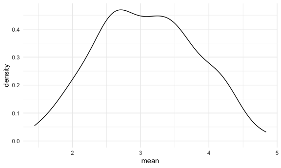
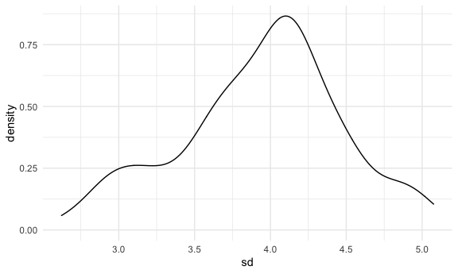
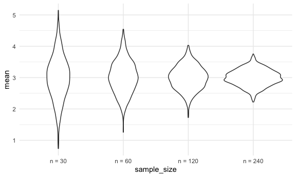

Simulations
================

## Let’s simulate something.

I have a function

``` r
sim_mean_sd = function(sample_size, mu = 3, sigma = 4) {
  
  sim_data = 
    tibble(
    x = rnorm(n = sample_size, mean = mu, sd = sigma)
  )

sim_data %>% 
  summarise(
    mean = mean(x),
    sd = sd(x)
  )

}
```

I can “simulate” by running this line

``` r
sim_mean_sd(30)
```

    ## # A tibble: 1 x 2
    ##    mean    sd
    ##   <dbl> <dbl>
    ## 1  3.33  3.70

## Let’s simulate a lot

Let’s atart with a for loop.

``` r
output = vector("list", length = 100)

for (i in 1:100) {
  
  output[[i]] = sim_mean_sd(sample_size = 30)
  
}

bind_rows(output)
```

    ## # A tibble: 100 x 2
    ##     mean    sd
    ##    <dbl> <dbl>
    ##  1  3.53  3.18
    ##  2  3.44  3.84
    ##  3  3.45  3.53
    ##  4  1.68  3.69
    ##  5  3.95  4.22
    ##  6  3.27  4.34
    ##  7  2.05  4.05
    ##  8  3.10  3.72
    ##  9  3.55  4.11
    ## 10  3.87  3.79
    ## # … with 90 more rows

Let’s use a loop function

``` r
sim_results = 
  rerun(100, sim_mean_sd(sample_size = 30)) %>% 
  bind_rows()
```

Let’s look at results…

``` r
sim_results %>% 
  ggplot(aes(x = mean)) + geom_density()
```



``` r
sim_results %>% 
  summarise(
    avg_sample_mean = mean(mean),
    sd_sample_mean = sd(mean)
  )
```

    ## # A tibble: 1 x 2
    ##   avg_sample_mean sd_sample_mean
    ##             <dbl>          <dbl>
    ## 1            2.98          0.756

``` r
sim_results %>% 
  ggplot(aes(x = sd)) + geom_density()
```



## Let’s try other sample sizes.

``` r
n_list = 
  list(
    "n = 30" = 30,
    "n = 60" = 60,
    "n = 120" = 120,
    "n = 240" = 240
  )

output = vector("list", length = 4)

output[[1]] = rerun(100, sim_mean_sd(sample_size = n_list[[1]])) %>% bind_rows()
output[[2]] = rerun(100, sim_mean_sd(sample_size = n_list[[2]])) %>% bind_rows()

for (i in 1:4) {
  
  output[[i]] = 
    rerun(100, sim_mean_sd(sample_size = n_list[[i]])) %>% 
    bind_rows()
  
}
```

``` r
sim_results = 
  tibble(
  sample_size = c(30, 60, 120, 240)
) %>% 
  mutate(
    output_lists = map(.x = sample_size, ~ rerun(1000, sim_mean_sd(.x))),
    estimate_df = map(output_lists, bind_rows)
  ) %>% 
  select(-output_lists) %>% 
  unnest(estimate_df)
```

Do zome data frame things.

``` r
sim_results %>% 
  mutate(
    sample_size = str_c("n = ", sample_size),
    sample_size = fct_inorder(sample_size)
  ) %>% 
  ggplot(aes(x = sample_size, y = mean)) +
  geom_violin()
```



``` r
sim_results %>% 
  group_by(sample_size) %>% 
  summarise(
    avg_sample_mean = mean(mean),
    sd_sample_mean = sd(mean)
  )
```

    ## `summarise()` ungrouping output (override with `.groups` argument)

    ## # A tibble: 4 x 3
    ##   sample_size avg_sample_mean sd_sample_mean
    ##         <dbl>           <dbl>          <dbl>
    ## 1          30            3.00          0.703
    ## 2          60            3.02          0.523
    ## 3         120            3.00          0.377
    ## 4         240            3.00          0.261

`set.seed(1)` is the function that used to keep the same random numbers
